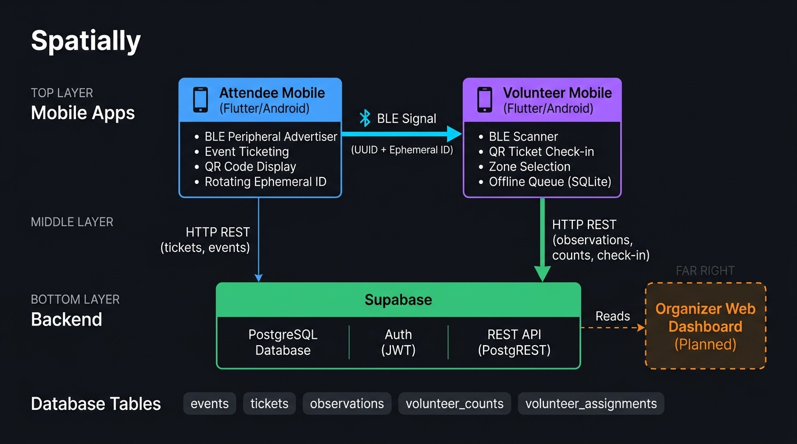
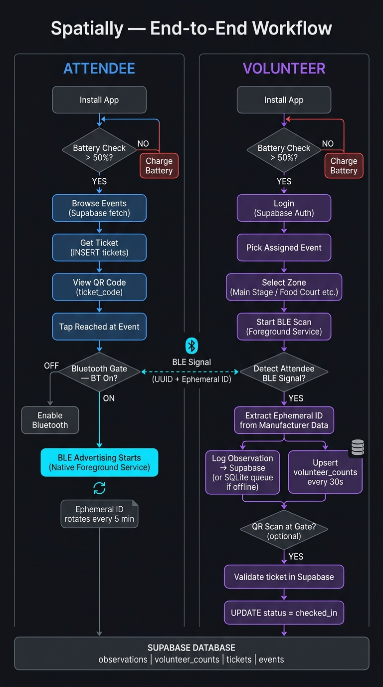

# Spatially — Complete System Overview

> **Audience:** Developers and contributors. This document covers the full
> end-to-end architecture, data flows, and implementation details of the
> Spatially platform as built through Phase 1 (mobile apps).

---

## 1. What Is Spatially?

Spatially is a **BLE-based crowd monitoring and event ticketing system**
built as a proof-of-concept for tracking attendee presence at live events.
The core idea: instead of requiring active check-ins or GPS (which is
inaccurate indoors), attendee phones passively broadcast Bluetooth Low
Energy (BLE) signals that volunteer phones silently detect and log to a
cloud database. Organizers get real-time zone-level crowd density data
without any effort from attendees beyond keeping the app running.

The system has three surfaces:

| Surface | Status | Description |
|---|---|---|
| attendee_mobile | Built | Flutter Android app — ticketing + BLE advertiser |
| volunteer_mobile | Built | Flutter Android app — QR check-in + BLE scanner |
| Organizer Web | Planned | Dashboard for real-time crowd density monitoring |

---

## 2. High-Level Architecture

Both mobile apps are Flutter (Android). Supabase is the shared backend (PostgreSQL + Auth + REST). The attendee phone acts as a BLE peripheral (advertiser) and the volunteer phone acts as a BLE central (scanner). The volunteer app writes all detection data to Supabase. The organizer web app (not yet built) will read from Supabase to display crowd density.

Tech Stack:
- Flutter (Android-only, compiled to release APK)
- Supabase: PostgreSQL database, Supabase Auth (email/password), REST API via supabase_flutter SDK
- BLE Advertising: Native Android Kotlin Foreground Service (BleAdvertisingService.kt) in a local patched plugin fork
- BLE Scanning: flutter_blue_plus package, running in a Foreground Service via flutter_foreground_task
- Offline Queue: SQLite (sqflite) + connectivity_plus for write-behind buffering on the volunteer side

---

## 3. Database Schema

All schema files live in apps/volunteer_mobile/supabase/. Apply them manually in the Supabase SQL Editor in version order (schema.sql, then v2, v3, v4).

### Table: events
Created in: schema_v4_events_tickets.sql

Columns: id (UUID PK), name (TEXT), venue (TEXT), event_date (TIMESTAMPTZ), status (TEXT: upcoming/live/ended), zones (TEXT[] — array of zone names), created_at (TIMESTAMPTZ).

Events are created manually in the Supabase dashboard. The zones column is a Postgres text array that dynamically drives the zone picker UI in the volunteer app.

### Table: tickets
Created in: schema_v4_events_tickets.sql

Columns: id (UUID PK), event_id (FK events), attendee_id (UUID — local device UUID, NOT linked to auth.users), ticket_code (TEXT UNIQUE — used for QR code), status (TEXT: purchased/checked_in), purchased_at, checked_in_at, checked_in_by (FK auth.users — volunteer who scanned).

Attendees do not log in. They are identified by a persistent UUID stored in shared_preferences (AttendeeIdentity). Reinstalling the app generates a new UUID and orphans old tickets.

### Table: volunteer_assignments
Created in: schema_v4_events_tickets.sql

Columns: id (UUID PK), volunteer_id (FK auth.users), event_id (FK events), assigned_at (TIMESTAMPTZ).

Rows are inserted manually by admins. The volunteer app queries this to show only assigned events.

### Table: observations
Created in: schema.sql, extended in v2 and v4.

Columns: id (UUID PK), created_at, ephemeral_id (TEXT — rotating 6-byte hex from BLE manufacturer data), rssi (INTEGER — signal strength dBm), scanned_at (TIMESTAMPTZ), is_spatially_device (BOOLEAN), volunteer_id (FK auth.users, added v2), zone (TEXT, added v2), event_id (FK events, added v4).

This is the core telemetry table. Every confirmed attendee BLE detection (after a 10-second dedup window) inserts one row here. The organizer dashboard will aggregate these for zone crowd density.

### Table: volunteer_counts
Created in: schema_v3_volunteer_counts.sql, extended in v4.

Columns: volunteer_id (UUID PK, FK auth.users), zone (TEXT), active_count (INTEGER), updated_at (TIMESTAMPTZ), event_id (FK events, added v4).

A live current-state table — not historical. Each volunteer UPSERTs this every N seconds while scanning. Organizer dashboard reads this for a real-time crowd heatmap.

---

## 4. Attendee Mobile App — Full Flow

### 4.1 Startup and Battery Gate

main() initialises Supabase and AttendeeIdentity (reads or generates a persistent device UUID from shared_preferences). First screen is BatteryCheckScreen:
- Battery below 50%: shows a blocking warning. Cannot proceed until charged.
- Battery 50% or above: navigates forward via pushReplacement (removes itself from back stack so pressing back exits the app — intentional design).

### 4.2 Event List and Ticketing

EventListScreen queries Supabase for events where status IN (upcoming, live), ordered by event_date.

Getting a ticket: user taps an event, app checks for existing ticket with matching (attendee_id, event_id). If none found, inserts a new ticket row with a fresh UUID as ticket_code and status = purchased. One ticket per attendee per event is enforced.

My Tickets: MyTicketsScreen fetches all tickets for the device attendee_id, joined with event details. Tapping opens TicketDetailScreen.

### 4.3 Ticket Detail and QR Code

TicketDetailScreen renders the ticket_code as a QR code using qr_flutter. A Reached at Event button is shown when status is purchased.

### 4.4 BLE Advertising — Core Feature

Tapping Reached at Event:
1. Navigator.pushAndRemoveUntil to AdvertiserScreen — removes the entire back stack. User is locked in (intentional — must stay advertising).
2. Bluetooth gate activates: if BT is off, a non-dismissable full-screen overlay blocks everything with an OS settings button. A blePeripheral.onPeripheralStateChanged listener auto-dismisses it and starts advertising the moment BT turns on.
3. Once BT is confirmed on, Dart calls the native BleAdvertisingService via MethodChannel (ble_service) to start a connectedDevice Android Foreground Service.

The Native Service (BleAdvertisingService.kt):
- Runs as an Android foreground service with a persistent notification.
- Owns the BluetoothLeAdvertiser directly in native Kotlin — survives screen lock. Flutter activity-level advertising is killed by Android 14 when the screen turns off; a native service is not.
- Advertises simultaneously: Service UUID f47ac10b-58cc-4372-a567-0e02b2c3d479 (Spatially custom UUID), and Manufacturer-specific data (Company ID 0xFFFF) containing the 6-byte rotating ephemeral ID.

The Rotating Ephemeral ID (ephemeral_id.dart):
  ephemeralId = sha256( deviceUUID + windowStartMillis )[0:6]
  windowStart = current UTC time rounded DOWN to nearest 5-minute boundary

The ID rotates every 5 minutes. A Timer in AdvertiserScreen calculates exact seconds until the next window boundary (secondsUntilNextWindow()) and schedules a precise native service restart.

Privacy: Volunteer phones never know the attendee real identity or static MAC. Each 5-minute window produces a completely different 6-byte hex string. Android 12+ also randomises the MAC address. The BLE data in Supabase cannot be used to persistently track any individual.

---

## 5. Volunteer Mobile App — Full Flow

### 5.1 Startup and Auth

main() initialises Supabase via TelemetryService.init(). Root widget is _AuthGate — a StreamBuilder on Supabase auth state. Routes to:
- LoginScreen — no active session
- BatteryCheckScreen — logged in but session not initialised
- EventPickerScreen — after battery check passes
- ZoneSelectionScreen — after event is picked
- ScanScreen — after zone is picked (main app state)

### 5.2 Battery Check, Event Picker, Zone Selection

Same 50% battery gate as the attendee app.

EventPickerScreen: queries volunteer_assignments JOIN events filtered by logged-in user UUID. Only assigned events appear. Tapping stores event_id in SessionState and navigates forward.

ZoneSelectionScreen: fetches the selected event zones TEXT[] from Supabase and renders as a list. Selected zone stored in SessionState. Navigates to ScanScreen.

SessionState singleton: in-memory store for volunteerId, eventId, zone, batteryChecked, syncRateSeconds. Cleared on logout.

### 5.3 BLE Scanning (ScanScreen)

Tapping Start Scan:
1. Requests runtime permissions: BLUETOOTH_SCAN, BLUETOOTH_CONNECT, ACCESS_FINE_LOCATION, POST_NOTIFICATIONS, battery optimisation exemption.
2. Bluetooth gate if BT is off — same non-dismissable overlay.
3. Starts flutter_foreground_task as a connectedDevice foreground service.
4. Starts BleScannerService subscribed to FlutterBluePlus.onScanResults.

BleScannerService mechanisms:
- UUID filter: only devices broadcasting f47ac10b-... are classified as Spatially.
- Sticky classification: once confirmed Spatially, stays classified until presence expires (handles Android BLE packet timing quirks where UUID doesnt appear in every packet).
- Ephemeral ID extraction: reads manufacturer data with company ID 0xFFFF, decodes 6 bytes as hex string. Used as device identity key for dedup and telemetry. Falls back to OS MAC address if missing/wrong length (logged as warning).
- Deduplication: 10-second per-device window — one observation per device per 10s forwarded to telemetry.
- Presence expiry: 45-second timeout — devices not seen for 45s are removed from _activeDevices.
- Hardware cache flush: native BLE scan stopped and restarted every 30 seconds to flush Android OS scan cache.
- Dual counters: Active Spatially devices right now vs Total unique Spatially seen this session.

### 5.4 Telemetry Pipeline and Offline Queue

When a dedup window passes, BleScannerService calls TelemetryService.sendObservation(obs) via scheduleMicrotask (runs after current BLE event loop turn — keeps scan callback lean).

TelemetryService delegates to ObservationQueue.sendOrQueue():
  1. Try: POST to Supabase REST /rest/v1/observations — success means done.
  2. Failure (no network): INSERT into local SQLite spatially_queue.db, table pending_observations.

Flush triggers:
  - App startup: flushes any leftover rows from previous offline session.
  - Connectivity regain: connectivity_plus listener fires _flushQueue().
  - Flush reads all SQLite rows, attempts Supabase insert for each. Deletes row only after confirmed success.

Volunteer Count Sync: a separate periodic timer UPSERTs to volunteer_counts every N seconds (10/30/60s, configurable via dropdown mid-scan without restarting the scan).

### 5.5 QR Ticket Check-in

QR scanner icon in AppBar opens QrScannerScreen (mobile_scanner). On scan:
1. Decodes ticket_code from QR.
2. Queries: SELECT * FROM tickets WHERE ticket_code = ? AND event_id = ?
3. Validates: ticket must exist, match current event, have status = purchased.
4. On success: UPDATE tickets SET status = checked_in, checked_in_at = now(), checked_in_by = volunteerId.
5. Shows result SnackBar.

### 5.6 Logout

AppBar logout:
1. Stops scan and foreground service.
2. Clears SessionState.
3. Calls supabase.auth.signOut().
4. Navigator.pushAndRemoveUntil rebuilds AuthGate at root — StreamBuilder detects auth change and routes to LoginScreen.

---

## 6. Native Plugin — flutter_ble_peripheral_patched

Location: apps/flutter_ble_peripheral_patched/ — local fork of the flutter_ble_peripheral pub.dev package.

Three files modified:
- PeripheralAdvertisingSetCallback.kt: added hasReplied boolean guard to prevent IllegalStateException: Reply already submitted crash on Android 14.
- FlutterBlePeripheralPlugin.kt: added ble_service MethodChannel for native start/stop service intents from Dart. Added activeAdvertisingSet capture for explicit enableAdvertising(false) call on stop.
- BleAdvertisingService.kt: full native foreground service owning BluetoothLeAdvertiser. Accepts EPHEMERAL_ID string via Intent extra and embeds as 6-byte manufacturer data (company 0xFFFF) alongside the service UUID.

pubspec.yaml override:
  dependency_overrides:
    flutter_ble_peripheral:
      path: ../flutter_ble_peripheral_patched

---

## 7. End-to-End Data Flow Example

Single complete detection cycle from attendee phone to Supabase:

Step 1 — Attendee phone (every 5 minutes):
  windowStart = round_down_to_5min(UTC now) = 1724598600000
  ephemeralId = sha256("device-uuid" + "1724598600000")[0:6] = "7d00e1300338"
  BleAdvertisingService advertises:
    Service UUID: f47ac10b-58cc-4372-a567-0e02b2c3d479
    Manufacturer data (0xFFFF): 7D 00 E1 30 03 38

Step 2 — Volunteer phone (within BT range):
  FlutterBluePlus.onScanResults fires
  BleScannerService reads mfr data → ephemeral_id = "7d00e1300338"
  UUID confirmed → is_spatially_device = true
  Dedup check: last seen 12s ago → passes (greater than 10s window)
  Creates BleObservation: { ephemeralId, rssi: -72, volunteerId, zone: "Main Stage", eventId, scannedAt }
  scheduleMicrotask → TelemetryService.sendObservation()

Step 3 — ObservationQueue:
  POST /rest/v1/observations { ... } → 201 Created

Step 4 — Supabase observations table:
  New row inserted. Organizer can query:
    SELECT zone, COUNT(DISTINCT ephemeral_id) as unique_attendees
    FROM observations
    WHERE event_id = ? AND scanned_at > now() - interval 5 minutes
    GROUP BY zone ORDER BY unique_attendees DESC

---

## 8. Supabase Configuration

Both apps read credentials from lib/config/supabase_config.dart:
  const String supabaseUrl     = 'YOUR_PROJECT_URL';
  const String supabaseAnonKey = 'YOUR_ANON_KEY';

This file is gitignored. Each developer must create it locally. Values are in the Supabase dashboard under Project Settings > API.

Supabase features used:
- Auth: volunteer email/password login. Attendees are anonymous (no auth).
- REST API (PostgREST): all reads and writes via supabase_flutter SDK.
- PostgreSQL 15: managed hosted database.
- Realtime: not yet used — planned for organizer dashboard.

RLS is currently DISABLED on all tables. Acceptable for internal prototype testing but must be addressed before production.

---

## 9. Security and Privacy Notes

- RLS: DISABLED — anyone with the anon key can read/write all tables. Must be fixed before production.
- Attendee identity: no login. Device UUID in shared_preferences — wiped on reinstall.
- BLE tracking prevention: rotating ephemeral ID every 5 minutes prevents long-term individual tracking.
- Credentials in repo: supabase_config.dart is gitignored.
- Anon key in APK: standard Supabase pattern — key is embedded in the built APK. RLS is the intended mitigation.
- Volunteer auth: Supabase Auth (JWT-based email/password).

---

## 10. Known Limitations and Tech Debt

- RLS disabled — must be addressed before production.
- Android only — iOS would require re-architecting the advertising side.
- Attendee identity wipes on reinstall — a proper attendee account system would fix this.
- No event management UI — events and assignments must be created in Supabase dashboard manually.
- No payment integration — ticket purchase is currently free and instant.
- Bluetooth edge case — OS kills the backgrounded volunteer app under memory pressure and scan does not auto-restart on resume.
- KGP warning — app_settings, mobile_scanner, flutter_ble_peripheral use legacy Kotlin Gradle Plugin. Non-blocking now, will fail in a future Flutter version.

---

## 11. Repository Structure

majorProject/
  README.md                            Quick-start for contributors
  SYSTEM_OVERVIEW.md                   This file (full technical detail)
  .gitignore
  apps/
    attendee_mobile/
      ATTENDEE_LOG.md                  Dev changelog
      pubspec.yaml
      android/app/src/main/AndroidManifest.xml
      lib/
        main.dart                      Entry point + AdvertiserScreen
        config/supabase_config.dart    GITIGNORED — add locally
        screens/
          battery_check_screen.dart
          event_list_screen.dart
          my_tickets_screen.dart
          ticket_detail_screen.dart
        services/
          attendee_identity.dart       persistent device UUID
          ephemeral_id.dart            SHA-256 rotating BLE ID
    volunteer_mobile/
      VOLUNTEER_LOG.md                 Dev changelog
      pubspec.yaml
      supabase/
        schema.sql
        schema_v2_volunteer_zone.sql
        schema_v3_volunteer_counts.sql
        schema_v4_events_tickets.sql
      lib/
        main.dart
        config/supabase_config.dart    GITIGNORED — add locally
        models/ble_observation.dart
        screens/
          battery_check_screen.dart
          login_screen.dart
          event_picker_screen.dart
          zone_selection_screen.dart
          scan_screen.dart
          qr_scanner_screen.dart
        services/
          session_state.dart
          ble_scanner_service.dart
          telemetry_service.dart
          observation_queue.dart
    flutter_ble_peripheral_patched/    Local plugin fork (attendee only)
      android/src/main/kotlin/.../
        BleAdvertisingService.kt       Native foreground advertiser
        FlutterBlePeripheralPlugin.kt  ble_service MethodChannel
        PeripheralAdvertisingSetCallback.kt  hasReplied crash fix

---

## 12. Team

Aryan — Mobile apps (attendee_mobile + volunteer_mobile), BLE architecture, Supabase schema
Blaise — Organizer web dashboard (upcoming)
Daksh — Organizer web dashboard (upcoming)
Devansh — Organizer web dashboard (upcoming)

---

## 13. How It All Works — In Plain Words

So let me just walk you through the whole thing like I am explaining it to someone who has not seen the code.

Imagine you are going to a live concert or a college fest. You download the Spatially attendee app, and it asks you to pick your event and get a ticket. That ticket is basically just a unique code stored in our database, tied to your phone. You did not have to create an account or log in with anything — the app just silently generates a permanent ID for your specific device behind the scenes and uses that to remember you. When you tap your event and get a ticket, a QR code appears on your screen. That QR code is what gets you through the entrance gate.

Now, the more interesting part. When you physically arrive at the venue and tap "Reached at Event" inside the app, your phone starts broadcasting a Bluetooth signal in the background. You do not feel anything, you do not see anything happening — it just quietly runs. Here is the clever part though: it is not broadcasting your name, your phone number, or any fixed identifier. Instead, it broadcasts a short 6-byte code that we call the ephemeral ID. This code is generated using a SHA-256 hash of your device ID combined with the current 5-minute time window. So every 5 minutes, the code your phone is sending out completely changes. Someone sitting nearby with a Bluetooth sniffer cannot track you across an event because the ID they saw 6 minutes ago has already changed and is completely unrelated to your current one. That is the privacy protection built right into the system.

On the other side, you have the volunteers — the people managing the event. They are using the volunteer app. They log in with their email and password, pick their assigned event, and then pick their zone — say, Main Stage or Food Court. When they hit Start Scan, their phone starts quietly listening for all Bluetooth devices around them. The app filters out all the random Bluetooth noise — other peoples earphones, speakers, whatever — and specifically looks for the Spatially service UUID, which is a custom identifier that only our attendee app broadcasts. When it finds a match, it reads the manufacturer data embedded in the Bluetooth packet, pulls out that 6-byte ephemeral ID, and logs it.

Here is what "logging it" actually means: the app takes that detection, packages it with the volunteer ID, their zone, the event ID, the signal strength, and the exact time, and sends it to Supabase. Supabase is our backend — it is essentially a hosted PostgreSQL database with a REST API on top. Every single detection event becomes a row in the observations table. If a volunteer is standing in the Food Court zone and 40 people walk past in 10 minutes, there will be 40 rows (one per unique device per 10-second dedup window) in the database, all tagged with "Food Court".

Separately, every 30 seconds, the volunteer app also sends a live count — like "right now I can see 12 Spatially devices in my zone" — to a different table called volunteer_counts. This is the table the organizer dashboard will read to show a real-time heatmap. The observations table is historical and will be used for analytics — which zones were most crowded at which times, when did people arrive, when did they leave.

There is also a practical check-in flow. When an attendee walks up to the entrance, a volunteer opens the QR scanner within the volunteer app, scans the attendee ticket QR, and if the ticket is valid and matches the current event, it marks it as checked in right there in the database. The volunteer can see instantly whether the ticket is genuine, already used, or for a different event.

One important thing to flag for anyone taking this further: right now, the database has Row Level Security turned off. That means anyone who has the Supabase anon key can read and write anything. This is fine for a closed prototype where you control who has the APK, but the very first thing to fix before a real deployment is locking down the database properly — making sure attendees can only write their own tickets, volunteers can only write observations for their assigned events, and the organizer dashboard reads data with appropriate access controls. That is the single most critical piece of unfinished work from a security standpoint.

Everything else is genuinely working end-to-end: BLE detection, offline queuing when there is no network, ticket check-in, rotating privacy IDs, multi-event support, zone-level tracking, and live counts. The foundation is solid — it just needs that security layer and the organizer-facing web interface to become a real product.

---

## 14. Diagrams

### Architecture Diagram

---

### End-to-End Workflow Diagram

